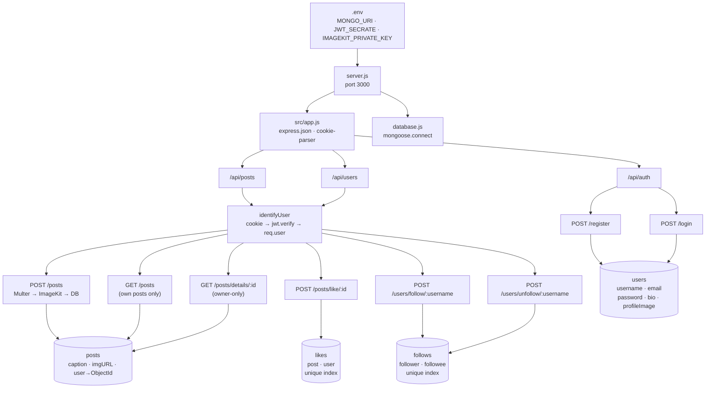

# Project: Instagram Clone Backend

A Node.js + Express REST API that replicates core Instagram features — auth, posts, likes, and follow/unfollow. Built as a learning project.

---

## Tech Stack

| Layer | Tool | Version |
|---|---|---|
| Runtime | Node.js | - |
| Framework | Express | ^5.2.1 |
| Database | MongoDB via Mongoose | ^9.9.3 |
| Auth | JWT (cookie-based) + bcryptjs | ^9.0.3 / ^3.0.3 |
| File Upload | Multer (memory storage) → ImageKit CDN | ^2.2.0 / ^7.11.0 |
| Config | dotenv, cookie-parser | ^17.4.2 / ^1.4.7 |

---

## Project Structure

```
server.js                         ← entry point, starts server on port 3000
src/
  app.js                          ← Express setup, middleware, router mounting
  config/
    database.js                   ← mongoose.connect(MONGO_URI)
  models/
    user.model.js                 ← users collection
    post.model.js                 ← post collection
    follow.model.js               ← follows collection (edge collection)
    like.model.js                 ← likes collection (edge collection)
  controllers/
    auth.controllers.js           ← register, login
    post.controllers.js           ← create post, get posts, post details, like post
    user.controller.js            ← follow, unfollow
  routes/
    auth.routes.js                ← /api/auth
    post.routes.js                ← /api/posts
    user.routes.js                ← /api/users
  middleware/
    auth.middleware.js            ← identifyUser (JWT guard)
```

---

## Environment Variables

```
MONGO_URI             — MongoDB Atlas connection string
JWT_SECRATE           — JWT signing secret (note: typo is intentional, used everywhere)
IMAGEKIT_PRIVATE_KEY  — ImageKit SDK private key for CDN uploads
```

---

## Data Models

### `users` collection — `user.model.js`
```js
{
  username:     String, required, unique
  email:        String, required, unique
  password:     String, required  // bcrypt hash, never returned
  bio:          String            // optional
  profileImage: String            // default: hosted default image URL
}
```

### `post` collection — `post.model.js`
```js
{
  caption: String,   // default ""
  imgURL:  String,   // required — ImageKit CDN URL
  user:    ObjectId  // required — ref: "users"
}
```

### `follows` collection — `follow.model.js` (edge collection)
```js
{
  follower:   String  // username of the person following
  followee:   String  // username of the person being followed
  // unique compound index: { follower, followee }
  // timestamps: createdAt, updatedAt
  
  // NOTE: status field (pending/accepted/rejected) is commented out
  // Current behaviour: follow is immediate, no approval needed
}
```

### `likes` collection — `like.model.js` (edge collection)
```js
{
  post: String  // post _id stored as string (ref: "posts")
  user: String  // username of the person who liked
  // unique compound index: { post, user } — prevents double-likes
  // timestamps: createdAt, updatedAt
}
```

### Model Relationships
```
users  ──(1:N)──  posts    via post.user → users._id (ObjectId)
users  ──(1:N)──  follows  via follower/followee username strings
users  ──(1:N)──  likes    via like.user username string
posts  ──(1:N)──  likes    via like.post = post._id as string
```

---

## Auth Flow

### Register `POST /api/auth/register`
1. Validate `username`, `email`, `password` are present
2. Check for duplicate username/email using `$or` query
3. Hash password with `bcrypt.hash(password, 10)`
4. Create user in DB
5. Sign JWT `{ id, username }` with 1-day expiry
6. Set `token` cookie + return 201 with user info + token

### Login `POST /api/auth/login`
1. Find user by username OR email
2. 409 if not found
3. `bcrypt.compare(password, user.password)` — 401 if wrong
4. Sign JWT same as register
5. Set `token` cookie + return 201 with user info + token

### `identifyUser` Middleware — `auth.middleware.js`
- Reads `req.cookies.token`
- Returns 401 if no token
- `jwt.verify(token, process.env.JWT_SECRATE)`
- Sets `req.user = { id, username }` on success
- Calls `next()`

---

## API Endpoints

### Auth — `/api/auth` (public)

| Method | Path | Body | Response |
|---|---|---|---|
| POST | `/api/auth/register` | `{ username, email, password }` | 201 `{ user, token }` |
| POST | `/api/auth/login` | `{ username/email, password }` | 201 `{ user, token }` |

### Posts — `/api/posts` (all protected via `identifyUser`)

| Method | Path | Body / Params | Notes |
|---|---|---|---|
| POST | `/api/posts` | multipart: `image` file + `caption` | Multer → ImageKit upload → create post |
| GET | `/api/posts` | — | Returns only the logged-in user's own posts |
| GET | `/api/posts/details/:postId` | `postId` param | Owner-only (403 if not author) |
| POST | `/api/posts/like/:postId` | `postId` param | Creates like; unique index prevents duplicates |

### Users — `/api/users` (all protected via `identifyUser`)

| Method | Path | Params | Notes |
|---|---|---|---|
| POST | `/api/users/follow/:username` | `username` to follow | Blocks self-follow; checks duplicate; immediate follow |
| POST | `/api/users/unfollow/:username` | `username` to unfollow | 404 if not following; deletes follow record |

---

## Request Flow

```
Incoming Request
  └─ express.json() + cookie-parser
       └─ Router matches path
            ├─ Public (auth routes)
            │    └─ Controller → MongoDB → set JWT cookie → JSON response
            │
            └─ Protected routes
                 ├─ [POST /posts only] Multer parses multipart form → req.file (buffer)
                 ├─ identifyUser middleware
                 │    ├─ reads cookie token → jwt.verify → sets req.user = { id, username }
                 │    └─ calls next()
                 └─ Controller
                      ├─ Post create: ImageKit.upload(req.file.buffer) → store CDN URL → create post doc
                      ├─ Post read:   Post.find({ user: req.user.id })
                      ├─ Post detail: Post.findById → check post.user === req.user.id
                      ├─ Like:        Like.create({ post: postId, user: req.user.username })
                      ├─ Follow:      Follow.create({ follower, followee }) after validations
                      └─ Unfollow:    Follow.findOneAndDelete({ follower, followee })
```

---

## Known Issues & Gotchas

1. **`JWT_SECRATE` typo** — the env key is misspelled as `SECRATE` (not `SECRET`). It's used consistently so it works — don't rename it without updating all references.

2. **Middleware missing `return`** — in `identifyUser`, the catch block sends a 401 but doesn't `return` before calling `next()`. This can cause "headers already sent" errors. Fix: add `return` before `res.status(401).json(...)`.

3. **`like.post` is typed as `String`** — but post IDs are MongoDB ObjectIds. It works because the string value of an ObjectId is stored, but it would be cleaner as `ObjectId` with a proper ref.

4. **Follows use username strings, not ObjectIds** — no MongoDB-level referential integrity. If a username changes, follow/like records would be orphaned. (No username update endpoint currently exists.)

5. **No duplicate-like error handling** — double-liking hits the unique index and throws a raw MongoDB error (code 11000) instead of a clean 409. Add a try/catch that checks `error.code === 11000`.

6. **No logout endpoint** — JWT is stateless and there's no cookie-clearing route or token blocklist.

7. **`getPostDetails` is owner-gated** — only the post author can view their own post details (returns 403 for others). May be intentional.

8. **`getPostController` returns own posts only** — no public feed or other user's posts endpoint exists yet.

---

## Architecture Graph


