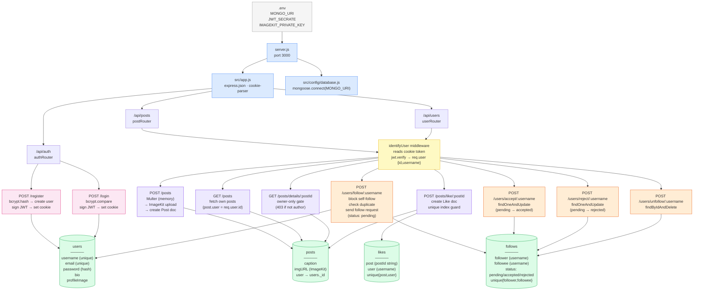

# Backend Architecture Graph

---

## Legend

| Color | Layer |
|---|---|
| 🔵 Blue | Infrastructure (server, app, db) |
| 🟡 Yellow | Middleware (auth guard) |
| 🩷 Pink | Auth controllers |
| 🟣 Purple | Post controllers |
| 🟠 Orange | User controllers |
| 🟢 Green | MongoDB models |
